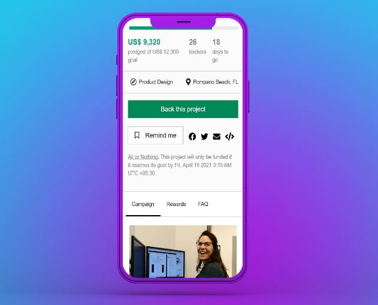

# Demo Project Kickstarter Clone

<h1>Additional description about the project and its features.</h1>

This is a project to demonstrate the knowledge of HTML5, CSS3, and Bootstrap. It is a clone of NuChair landing page by kickstarter.com.

Current state: The clone has been designed in the mobile-view first approach. As of now, the clone works in mobile view and desktop view.

Future implementation: Make it responsive in tablet view.

 

 

<i>Built With HTML5, CSS3, Bootstrap, GIT, and VSCODE</i>

Live Demo : https://kickstarter.netlify.app/

Original Page: https://www.kickstarter.com/projects/snp/nuchair-sit-longer-sit-healthier-without-pain/description

<h1>How to contribute</h1>

To get a local copy up and running follow these simple example steps.

1. Go to https://github.com/Abhigyan001/Kickstarter_Clone
2. Click on code and copy the html code.
3. Use git bash to clone this repository on your local machine.
4. Run git checkout -b your-branch-name Make your contributions
5. Push your branch up to your forked repository
6. Open a Pull Request with a detailed description to the development branch of the original project for a review

Prerequisites Text editor, Github profile and Git.

<h2>Author</h2>

👤 ABHIGYAN Mahanta

- Github: @Abhigyan001
- Linkedin: https://www.linkedin.com/in/abhigyanmahanta/

🤝 Contributing Contributions, issues and feature requests are welcome!

Feel free to check the issues page.

Show your support Give a ⭐️ if you like this project!

📝 All rights are reserved for Abhigyan.
